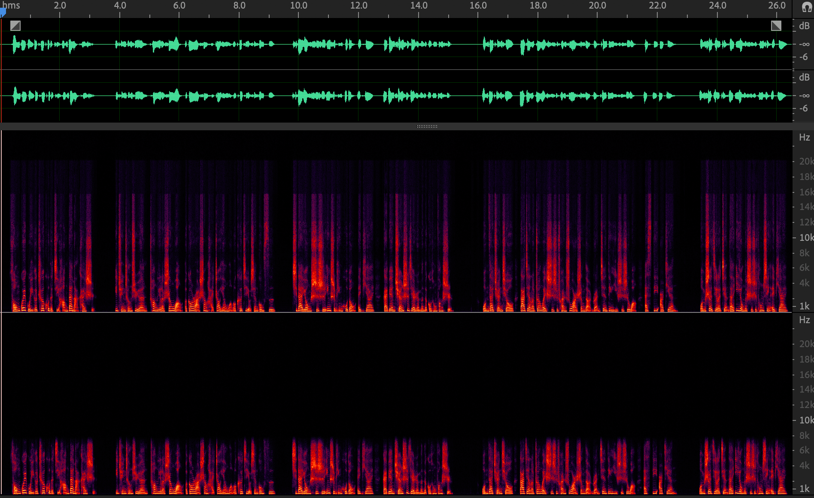

# A01 | 声音信号是如何保存成数字信号的？

## 1. 音频信号的关键指标

麦克风采集声音的过程：

1. 声波通过空气传播到麦克风的振膜；
2. 振膜随空气抖动的振幅大小产生相应的、带有声学表征的电学信号（`Analog Signal`，模拟信号）；
3. 通过模数转换器（`A/DC`）将模拟信号转换成数字信号（`Digital Signal`）；即，通过脉冲编码调制器（`PCM`，**P**ulse **C**ode **M**odulation）对连续变化的模拟信号进行 **抽样**、**量化** 和 **编码** 转换成 **离散的数字信号**。

音频领域常说的 `PCM` 文件，就是未经封装的音频原始文件（音频“裸数据”）。

### 指标1：采样位深

概念：每个采样点用多少比特位（`bit`）的信息量来表示，位深就是多少。

物理意义：表征振幅的精确程度（或粒度）。

位深为 16，则表示每个采样点需要 16 `bit` 来存储。若数字信号是一个 `-1` 到 `1` 的区间，则 16 `bit` 中的第 1 位用于表示正负，其余 15 位可以记录 0 ~ 32767 个整数（`[0, 2^15 - 1]`），则振幅可以精确到 `1/32768` 的粒度了。

不同场景的常见位深：

- 网络电话：16 `bit`
- 音乐：32 `bit` 或 64 `bit`（高保真）或 8 `bit`（刻意制造的听感朦胧的音乐艺术类型）

### 指标2：采样率

概念：一秒内采集到的采样点个数，一般用赫兹 `Hz` 表示。

一秒内有 48000 个采样点，对应采样率为 48000 `Hz`（48 千赫、48 kHz）。

> **奈奎斯特采样定理**
>
> 根据奈奎斯特采样定理，数模转换时，采样频率 `fs` 大于信号中的最高频率 `fmax` 两倍时（`fs > 2 * fmax`），采样后的数字信号才能完整保留原始信号中的信息。因此采样率和声音频率基本上是 2 倍的关系。

对比16 `kHz` 采样率（下）与 48 `kHz` 采样率（上）的频谱能量分布：

可以看到，16 `kHz` 采样率的音频在 8 `kHz` 以上的频谱是没有能量的，说明这部分高频信息因为采样率不足而丢失了。听感上的就会显得低沉、沉闷。

但采样率也不是越高越好，要根据应用场景而定：

- 打电话：8 `kHz`
- 网络会议：16 `kHz` 或 32 `kHz`
- 音乐会、音乐直播：44.1 `kHz` 或 48 `kHz`
- 制作音乐录音：96 `kHz`（方便调音和后期制作）

### 指标3：通道数

物理含义：同一时间 **采集或播放** 的音频信号的总数。

`2.1` 声道或者 `5.1` 声道等名词，这些数字代表了 **有多少个播放单元**。

`2.1` 声道中的 `2` 指的是 **左右两个音箱**，`1` 指的是中间一个低音音箱（如图所示）。每个音箱都会播放一个单独的音频，即需要同时有三路音频信号同时播放，亦即，通道数为 3。

立体声（`stereo`）指的就是双声道音频。

> **练习**
>
> 一个立体声 `PCM` 音乐文件，记录了 1 分 40 秒采样率为 48 `kHz` 的音频，位深 16 `bit`。问：该文件应该占用多大存储空间？如果不经压缩实时传输播放，需要多少带宽？
>
> 答：存储空间 = 位深 × 采样率 × 通道数 × 时长 = 16 × 48000 × 2 × 100 = 1.53 e8 `bit` = 18.31 `MB`
> 比特带宽 = 存储空间 ÷ 时长（秒）= 位深 × 采样率 × 时长 = 1.53 e6 bps = 1500 `Kbps`

## 2. 音频的封装

### 2.1. 有损和无损的音频编码封装格式

有损的音频编码封装格式：通过压缩算法压缩后，文件在解压时无法完美还原音频的原始数据（有损）。常见格式：`MP3`、`WMA` 等。

无损的音频编码封装格式：压缩后可完美还原的压缩算法。如：`FLAC`、`APE` 等。

`FLAC` 的压缩率为 58.7%，`APE` 更高一些，为 55.5%；

`MP3` 的压缩比可达 `1:10`，即存储体积为原始大小的十分之一，音质若非专业人士很难听出区别。

常见的音频编码封装格式如下：

|     类别     |                       格式                        |
| :----------: | :-----------------------------------------------: |
| 无损编码封装 |    `APE`、`FLAC`、`ALAC`、`WAV`、`AIFF`、`WMA`    |
| 有损编码封装 | `MP3`/`MP3 Pro`、`AAC`、`AMR`、`WMA`、`RA`、`OGG` |

音频工程师经常把音频处理中的中间变量（未封装的音频数据）另存为 `PCM` 文件。虽然无需封装且方便存储，但 `PCM` 文件是无法直接读取播放的，即便拖到音频处理软件 `Audacity` 中也需要提供位深、采样率、通道数等才能解析。这个问题可以通过简单封装为 `WAVE` 格式来解决。

### 2.2. `WAVE` 文件的封装

无损压缩还可以不压缩编码，直接加个文件头作为封装，这就是 `WAVE` 格式的封装，文件扩展名为 `.wav`。

`WAVE` 文件格式基于 `RIFF` （**R**esource **I**nterchange **F**ile **F**ormat）标准，由文件头和数据体两部分构成。其中 0 ~ 43 字节存放头信息，如采样率、通道数、数据部分的标识符等；后面的字节就是数据部分。

WAVE 文件可以理解为一个描述文件基本信息的文件头，和一个 PCM 文件构成。文件头个字节的含义如下：

| 偏移地址 | 字节数 | 数据类型 |                             内容                             |
| :------: | :----: | :------: | :----------------------------------------------------------: |
|   0x00   |   4    |   char   |                         "RIFF" 标志                          |
|   0x04   |   4    | long int |                           文件长度                           |
|   0x08   |   4    |   char   |                         “WAVE” 标志                          |
|   0x0C   |   4    |   char   |                          “fmt” 标志                          |
|   0x10   |   4    |          |                       过度字节（不定）                       |
|   0x14   |   2    |   int    |          格式类别（`0x10` 是 `PCM` 形式的声音格式）          |
|   0x16   |   2    |   int    |               通道数（1 为单声道，2 为双声道）               |
|   0x18   |   4    | long int |        采样率（每秒的样本数，表示每个通道的播放速度）        |
|   0x1C   |   4    | long int | 波形音频数据传输速率（通道数 × 每秒数据位数 × 样本的数据位数 / 8，浏览器可据此估算缓冲区大小） |
|   0x20   |   2    |   int    | 采样帧大小（= 通道数 × 位数 / 8）。播放软件需要一次处理多个该值大小的字节数据，用该数值调整缓冲区。 |
|   0x22   |   2    |   int    | 每样本的数据位数。表示每个声道中各样本的数据位数（8 bit 或 16 bit）。若为多声道，则各声道的样本大小都一样。 |
|   0x24   |   4    |   int    |         ASCII 字符 “data”，标示头结束，开始数据区域          |
|   0x28   |   4    | long int |                           数据大小                           |

可见，`WAVE` 格式支持单、双声道的音频文件封装；采样位深支持 8 `bit` 和 16 `bit` 两种。单通道和双通道数据的排列示意图如下：

可见，双声道时，左右声道的数据是 **间隔排布** 的。这主要是为了方便可以按照 **时间连续成块地** 读取数据信息，而不是读完一个声道再读下一个。

## 3 小结

- 采样位深、采样率、通道数是描述音频信号的关键指标。采样位深越深、采样率越高，则音质越好，但同时消耗的存储和传输的资源也就越多；
- 编码封装时，若需要尽量缩小存储音频的体积，那么可以选用 `MP3` 等有损的编码封装格式；若需要无损、高保真的音频，则采用诸如 `FLAC` 等无损格式来编码封装；
- 其中对于音频开发者而言，`WAVE` 格式由于可以迅速快捷地封装一个 `PCM`（音频裸数据文件）而被广泛使用；
- 实际使用时可以根据自己的使用场景，选择音频信号的关键指标和封装形式；
- 眼看为虚，耳听为实：多听听不同的采样率，不同的采样位，深会听感；

## 4 思考

为什么有的音频文件，文件显示的是 `48kHz` 的采样率和 `16bit` 的位深，但听起来还是很闷或者听感很差呢？

参考：

从音频文件采集，存储，播放来看，任何一个环节都会引发这个问题；
采集：原始音频文件采集的设备质量不高，导致高频段有损伤
存储：音频文件采用有损压缩，可能会造成高频段损伤
播放：播放设备质量差，不能很好表现高频段信号