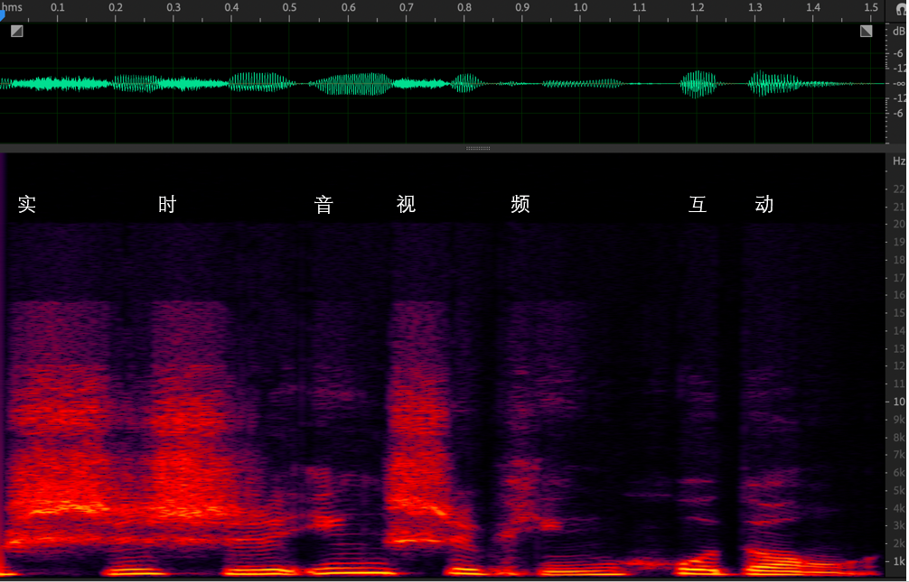
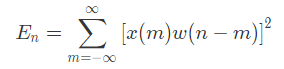
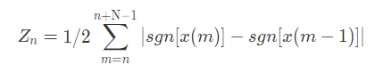
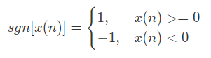

# A02 | 如何量化分析语音信号？

2021-11-24 冯建元

语音和音乐是两种最常见的音频信号类型，本节及下一节将分别从这两种类型入手，介绍如何科学、量化地对音频信号进行分析。

先来看语音信息的分析方法。

---


## 1 语音的基本特征

**语音** 是 **声源** 和 **声道** 共同作用的结果。

**声源** 即声音的来源；所谓 **声道**，就是声音传播所通过的地方。

人体发音器官结构示意图如下：


发音时的声道主要对应三个腔体：**咽腔**、**口腔**、**鼻腔**


### 1.1. 浊音和清音

语音按发音原理分类，可分为：

- 清音：气流经过唇齿等狭小区域，与腔体摩擦而产生的声音；（如拼音 `shi`、`chi`、`xi`）
- 浊音：以声带振动为声源产生的声音；（如拼音 `a`、`o`、`e` 等）

两者在频谱图的对比如下：



上图为“实时音视频互动”几个字的音频信号时域图和频域图对比。

时域图：**信号幅度** 和 **时间** 的关系图。

频域图：**能量** 随 **时间、频率** 的分布关系图。

频域图是对不同频率能量随时间分布的热力图描述。图中“互动”是明显的有规律的能量分布——低频能量大于高频、且有明显的能量集中区域（亮线部分）。“实时”和“视”这三个字，都有 `sh` 这个清音，都是由齿间高速气流摩擦产生。图中的清音在频谱上显示为比较均匀的分布，且在 13kHz 的高频也有不少的能量。由此可以从频谱上大致分辨 **清音** 和 **浊音**。

除了清浊音外，描述音频信号的特征还有 **基频**、**谐波**、**共振峰** 等基础概念。


### 1.2. 基频

概念：是 **发浊音** 时，由声带振动产生的声波（`基波`）所对应的频率，常用 `F0` 表示。

基频对应平时所说的音调。如某某唱歌音调较高，就是说此人的声音基频较高。

男生正常说话的基频：100 ~ 200 `Hz`
女生正常说话的基频：140 ~ 240 `Hz`
小孩：300 `Hz` 左右，一般年龄越大，基频越低。

基频在频谱图中对应的是 ***浊音中频率最低的亮线***。


### 1.3. 谐波

这是与基波相对的一个概念，是由基波在传输过程中，经反复碰撞声道而反射形成的一组声波，其频率数倍于基频。谐波按频率从低到高的顺序，依次称为 1 次谐波、2 次谐波……如下图所示：


**谐波频率和基频是浊音能量最集中的地方**，在频谱图中呈 **栅格状**。


### 1.4. 共振峰

概念：在浊音产生过程中，声波通过声道也会使声道本身发生 **共振**。与声道共振频率相近的能量会被增强，而远离共振频率的部分则会被削弱，形成一组高低起伏的包络。这些包络中的波峰位置，就叫共振峰。

如图所示，英文单词 `father` 的 `a` 音对应三个明显的共振峰，频率分别为 750 `Hz`、1100 `Hz`、和 2600 `Hz`：


共振峰示意图

可见，不同的发音，共振峰的位置和波峰都是不同的。可以据此建立共振峰和发音的对应关系——这也是语音识别背后的原理之一 —— **通过共振峰的位置和能量分布来识别音频代表的语音**。


## 2 语音信号的分析

接下来将从时域、频域两个方面，介绍几个常用的语音分析方法。具体分析开始前，通常会使用 **窗函数** 进行预处理。


### 2.1. 窗函数

分析音频时域或频域特征时，常常需要把音频截断成一个个小的时间片段（`音频帧`），比如以 10 `ms` 的切片作为 1 帧。

但如果直接截断信号则会导致频谱泄漏，出现不该有的频谱分量。例如对一个 50 `Hz` 的单频信号直接截断，可能出现 60 `Hz`、200 `Hz` 的能量分量。因此，我们一般采用“**加窗**”的手法，令原有信号乘以一个两端为 0 的“**窗信号**”，来减少频谱泄漏。

常用的窗函数有 `Haning`（汉宁窗）、`Hamming`（汉明窗）、`Blackman`（布莱克曼窗）等。在时域上加窗（`Haning`）的过程下图所示：


如图所示，加窗的过程，其实就是 **输入信号乘以窗函数**，得到了一个 **两边小、中间高的新信号**。


### 2.2. 时域分析

时域分析涉及两个评价指标：**短时能量** 与 **短时平均过零率**

#### 1 短时能量

语音能量的大小往往对应不同的音频状态：能量小可能意味着没有说话，而能量大的地方可能是重读。语音能量随时间的变化通常较快，由此衍生出一个概念——短时能量。它常被用来 **判断语音的起止位置或者韵律**。短时能量分析的公式定义如下：



其中——

- *x*：代表采样点；
- *ω*：代表窗函数；
- *E<sub>n</sub>*：代表第 *n* 个点的短时能量，其数值，是加窗后的采样信号的平方和；

由于不涉及频谱分析，这里的窗函数可以使用简单的矩形窗。

短时能量主要有以下三个方面的应用：

1. 区分 **清浊音**。一般来说，清音部分的能量比浊音部分的能量要 **小很多**；
2. 区分 **有声段** 和 **无声段**。比如，可以设置一个能量阈值，作为判定该语音段 **是否为静音段** 的条件；
3. 判断 **韵律特征**（如重读音节）。


#### 2 短时平均过零率

顾名思义，就是每音频帧内信号通过零值的次数。连续的音频信号是围绕 0 值上下波动的，表现为信号的正负号随时间不断切换。

短时平均过零率可以通过下列公式计算：





其中——

- *N*：表示一个音频帧中包含的信号点个数；
- *sgn*：表示符号函数；
- *x*：表示音频采样点。

对于像 2.1 小节那样的正弦信号，其短时平均过零率，就是信号的频率与二倍采样频率之商。

短时平均过零率的用途：

- 判定清浊音：由于清音的频率分布较浊音更广，所以浊音的过零率要 **低于** 清音，从而可用于初步判定清浊音；
- 可与短时能量相结合，共同判断语音的起止位置：背景噪声较小时，短时能量的判定结果更准确；背景噪声比较大时，短时平均过零率更胜一筹。一般的音频识别系统都是基于这个原理。


### 2.3. 频域分析

下面介绍频域分析中常用的两种方法：短时傅里叶变换与梅尔谱。


#### 1 短时傅里叶变换

短时傅里叶变换，又简称 `STFT`（`Short-time Fourier Transform`），是音频频域分析最常用的一种方法，可用于 **绘制频谱图**。

短时傅里叶变换步骤：

- 首先，对时域信号加滑动窗，避免音频切成若干个短帧的同时出现频谱泄漏（可使用汉宁窗）；
- 然后，对每一帧做快速傅里叶变换（`Fast Fourier Transform`，简称 `FFT`），将时域信号转换为复数域的频域信号；

示意图如下：


其中——

- Hop Length：表示滑动窗移动一次的距离；
- Overlap Length：表示两个相邻滑动窗重叠的距离；

绘制频谱图，实际上就是将短时傅里叶变换的结果对复数的频域信号求模，并取对数转换成分贝（`dB`），然后用热力图的形式展示出来。频谱图的横轴表示时间，纵轴表示信号频率，热力图中的颜色则代表每个频点在当前时刻的能量大小。

这样就能通过频谱图来观察每个时刻的语音能量分布了。因此通过短时傅里叶变换得到的频谱图，也称作 **声谱**、**线性谱**、**语谱**。


#### 2 梅尔谱

梅尔谱（`Mel spectrum`）的出现，源于人耳对以 `Hz` 为单位的频率并不是很敏感。

这是由人的心理与听力系统的构造决定的。我们很难区分 500 `Hz` 和 510 `Hz` 的差异。

平时人耳能区分的音调都是以按 **指数** 排列的。所谓的“高八度”，其实是把原频率乘以二。因此，用对数坐标来表示频率，可以更好地反映人的 **实际听感**。
此外，人耳对不同频率声音大小的感知度也是不同的。人耳感知的响度一般用 `phon`（方）来表示。下图为人耳感知音量的等响曲线，红线代表人耳感知到的响度和实际声压（分贝）的对应关系：


如图所示，人耳对 4 `kHz` 对应的声音响度较敏感，而两端的高频或低频，则需要更强的声压才能感知到。这其实和人类的进化有关：4 `kHz` 多为猛兽叫声的能量分布范围，所以人耳对这类危险的频率较为警觉。

为了适应人耳对频率的感知，需使用对数坐标描述频率，并通过分配 **滤波器组**，对频谱图的能量按照 **听感** 重新分配，就有了梅尔谱（`Mel 谱`）等表示形式。

`Mel 谱` 的计算步骤如下：

1. 对语音信号进行预加重（平衡高低频能量）；
2. 通过 `STFT` 变换得到频率谱；
3. 通过 `三角滤波器组` 对频率谱 **逐帧滤波**。

三角滤波器组如下图所示：


可以看到，**三角滤波器组** 把信号频率划分成了若干个频段，并使得敏感频段的滤波器分布更密集，而非敏感频段较稀疏。这样就能更好地表征人耳的实际听感。

此外，还可以对梅尔谱再进一步求 **倒谱系数**，得到 **梅尔倒谱系数**（`MFCC`）。`MFCC` 常用于语音识别、声音事件识别等领域。

除了梅尔谱，其它基于人耳实际听感的分析方法还包括 `Bark` 谱、`Gamma Tone Filter` 等。


## 3 小结

扎实的理论基础于常见分析方法的掌握，有利于今后在设计语音算法、分析语音特征时更有针对性地进行选择。

本节要点梳理：

- 语音根据发音原理的不同，分为 **清音** 和 **浊音**；根据其在频谱图上的分布规律，可以从频谱上 **分辨清浊音**；
- **只有浊音** 才有 **基频** 和 **谐波**。发浊音时声带振动产生的声音叫 **基波**，基波的频率叫 **基频**。**基频** 即 **音调**；
- **谐波** 是频率倍数于 **基频** 的声波；
- **共振峰** 是发音受腔体形状的影响的结果。其位置和幅度可以和发音一一对应，从而可通过 **共振峰** 的位置和能量分布来识别语音；
- 做音频分析时候需要对音频信号进行截断。**加窗** 可以有效防止因信号截断引发的 **频谱泄漏**；
- **短时能量** 和 **短时平均过零率** 是时域分析的常见指标，可用于 **判断清浊音** 及 **语音起止位置**；
- 频域分析常使用 **短时傅里叶变换** 和 **梅尔谱** 等方法。**梅尔谱** 更能反映人耳的实际听感。


## 4 思考题

利用 `Python` 音频处理工具 `librosa` 绘制频谱图和梅尔谱。示例代码如下：

```python
#绘制STFT
import numpy as np
import librosa
import matplotlib.pyplot as plt
audio,sr=librosa.load('Path',sr=48000)
n_fft=1024
ft = np.abs(librosa.stft(y[:n_fft], hop_length = n_fft+1))
plt.plot(ft)
plt.title('Spectrum')
plt.xlabel('Frequency Bin')
plt.ylabel('Amplitude')
#绘制梅尔频谱
mel_spect = librosa.feature.melspectrogram(y=y, sr=sr, n_fft=2048, hop_length=1024)
mel_spect = librosa.power_to_db(spect, ref=np.max)librosa.display.specshow(mel_spect, y_axis='mel', fmax=8000, x_axis='time');
plt.title('Mel Spectrogram');
plt.colorbar(format='%+2.0f dB');
```


