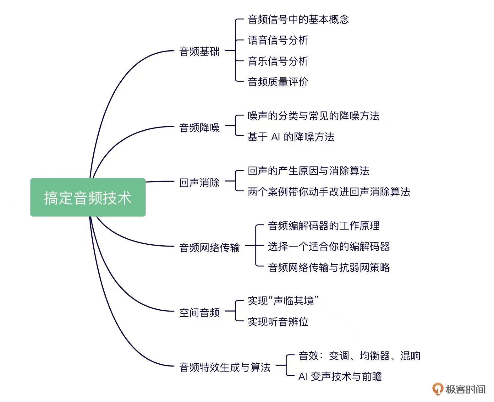

# 《Geektime  - Master Audio / Video Technology》Learning Notes

## 1. Profiles

|    **Title**    | **Geektime  - Master Audio / Video Technology** |
| :-------------: | :---------------------------------------------: |
|   **Author**    |                **冯建元、李江**                 |
| **Publication** |            **Geek Time, 2021.11.22**            |
| **Audio Parts** |                     **19**                      |
| **Video Parts** |                     **19**                      |

> **Introduction - Audio part**

> **Introduction - Video part**

## 2. Outlines 

Status available：:heavy_check_mark: (Completed) | :hourglass_flowing_sand: (Working) | :no_entry: (Not Started)

### 2.1. Audio part

| No.  |                        Chapter Title                         |          Status          |
| :--: | :----------------------------------------------------------: | :----------------------: |
| A01  | [开篇词 \| 实时互动强势发展，如何快速入门音频技术？](./A01.md) |    :heavy_check_mark:    |
|      |                     **音频基础（4 讲）**                     |                          |
| A02  |           [声音是如何保存成数字信号的？](./A02.md)           | :hourglass_flowing_sand: |
| A03  |              [如何量化分析语音信号？](./A03.md)              |        :no_entry:        |
| A04  |             [如何分析与处理音乐信号？](./A04.md)             |        :no_entry:        |
| A05  |            [如何评价音频质量的好与坏？](./A05.md)            |                          |
|      |                     **音频降噪（2 讲）**                     |                          |
| A06  |              [音频降噪如何对症下药？](./A06.md)              |        :no_entry:        |
| A07  |           [如何将 AI 技术运用到降噪中？](./A07.md)           |        :no_entry:        |
|      |                     **回声消除（2 讲）**                     |                          |
| A08  |         [如何通过算法自动快速地消除回声？](./A08.md)         |        :no_entry:        |
| A09  |               [回声消除算法实践指南](./A09.md)               |        :no_entry:        |
|      |                   **音频网络传输（3 讲）**                   |                          |
| A10  |            [音频编解码器是如何工作的？](./A10.md)            |        :no_entry:        |
| A11  |          [如何选择一个适合你的编解码器？](./A11.md)          |        :no_entry:        |
| A12  |      [网络差怎么办？音频网络传输与抗弱网策略](./A12.md)      |        :no_entry:        |
|      |                     **空间音频（2 讲）**                     |                          |
| A13  |        [空间音频入门：如何实现“声临其境”？](./A13.md)        |        :no_entry:        |
| A14  |           [如何利用 HRTF 实现听音辨位？](./A14.md)           |        :no_entry:        |
|      |                **音频特效生成与算法（3 讲）**                |                          |
| A15  |          [音效三剑客：变调、均衡器、混响](./A15.md)          |        :no_entry:        |
| A16  |    [加餐 \| 音频技术漫谈之好声音是怎么炼成的？](./A16.md)    |        :no_entry:        |
| A17  |         [AI 变声：音频 AI 技术的集大成者](./A17.md)          |        :no_entry:        |
|      |                      **结束语（2 讲）**                      |                          |
| A18  |                 [选择比努力更重要](./A18.md)                 |        :no_entry:        |
| A19  |         [期末测试 \| 来赴一场满分之约吧！](./A19.md)         |        :no_entry:        |

### 2.2. Video part

| No.  |                       Chapter Title                        |          Status          |
| :--: | :--------------------------------------------------------: | :----------------------: |
| V01  | [开篇词 \| 为什么说视频开发是程序员的一片蓝海？](./V01.md) |    :heavy_check_mark:    |
|      |                **图像基础和前处理（3 讲）**                |                          |
| V02  |        [基本概念：从参数的角度看视频图像](./V02.md)        | :hourglass_flowing_sand: |
| V03  |      [TUV & RGB：原来图像是这么丰富多彩的](./V03.md)       |        :no_entry:        |
| V04  |         [缩放算法：如何高质量地缩放图像](./V04.md)         |        :no_entry:        |
|      |                    **视频编码（5 讲）**                    |                          |
| V05  |      [编码原理：视频究竟是怎么编码压缩的？](./V05.md)      |        :no_entry:        |
| V06  |         [码流结构：原来你是这样的 H264](./V06.md)          |        :no_entry:        |
| V07  |          [帧内预测：如何减少空间冗余？](./V07.md)          |        :no_entry:        |
| V08  |          [帧间预测：如何减少时间冗余？](./V08.md)          |        :no_entry:        |
| V09  |          [变换量化：如何减少视觉冗余？](./V09.md)          |        :no_entry:        |
|      |               **视频传输和网络对抗（5 讲）**               |                          |
| V10  |   [RTP & RTCP：如何正确地将视频装进 RTP 中？](./V10.md)    |        :no_entry:        |
| V11  |       [带宽预测：3 大算法准确预估网络带宽](./V11.md)       |        :no_entry:        |
| V12  |       [码控算法：如何控制视频的编码码率？](./V12.md)       |        :no_entry:        |
| V13  |   [Jitter Buffer：拿什么拯救你，花屏卡顿问题](./V13.md)    |        :no_entry:        |
| V14  |         [SVC：如何实现视频编码可伸缩？](./V14.md)          |        :no_entry:        |
|      |                 **视频封装和播放（3 讲）**                 |                          |
| V15  |           [MP4 & FLV：不要再说 AVI 了](./V15.md)           |        :no_entry:        |
| V16  |     [加餐 \| 基于纯浏览器的视频会议方案探究](./V16.md)     |                          |
| V17  |     [音画同步：如何让声音和画面手拉手前进？](./V17.md)     |        :no_entry:        |
|      |                     **结束语（2 讲）**                     |                          |
| V18  |                [信心比黄金更重要](./V18.md)                |        :no_entry:        |
| V19  |        [期末测试 \| 来赴一场满分之约吧！](./V19.md)        |        :no_entry:        |

