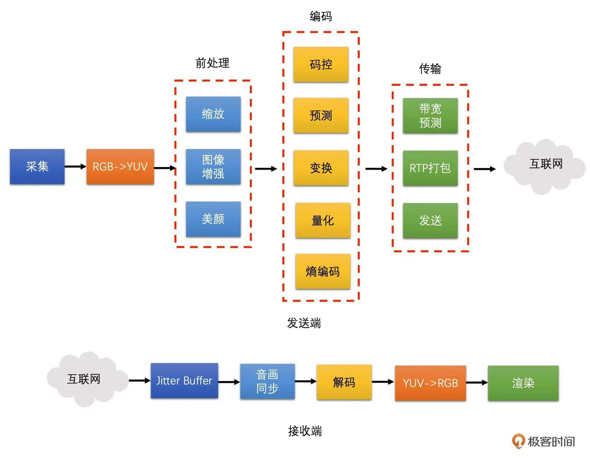

# 开篇词 | 为什么说视频开发是程序员的一片蓝海？

## 讲师

李江

## 蓝海的证据

- 现在是视频技术最好的时代：当下即刚需（视频技术成为互联网平台的标配），未来亦是星辰大海（AI、元宇宙的推动）；
- 随着抖音、快手等短视频平台的火爆，市场对视频研发人才的需求越来越旺盛；
- 直播带货、视频会议等场景的更新迭代，也为工程师创造了很多新的机会；
- 现阶段做音视频开发的薪资水平，至少比同资历的 Android 开发高出 30% 左右；

## 视频技术的门槛

- 短视频需要在保持高画质的前提下，尽可能压缩视频文件——这很难，但也很重要；
- 直播连麦涉及的 RTC 技术和直播技术，要求在各种网络状况下实现超低延时、降低卡顿率——又一个非常难的问题；
- 大型视频会议要求多人同时在线时，确保会议流畅度，提高画质、降低卡顿——颇具挑战。
- 涉及的知识点庞杂：如信号处理技术、AI 技术、信息论和数学、网络协议和拥塞控制算法等等。
- 市面上系统介绍相关技术的资料不多。

相关知识图谱：

## 课程设计

本课程分图像基础和前处理、视频编码、视频传输和网络对抗、视频封装和播放等四个模块进行介绍。

**图像基础和前处理** 模块：从视频和图像的基本概念开始，逐步延伸到视频的颜色空间（尤其是 YUV 颜色空间，基础核心概念，也是重难点）、常用的图像缩放算法及原理等，循序渐进，逐个击破。

**视频编码** 模块：重点介绍编码算法的底层原理和具体算法实现。只有深入原理，才能快速实践。

**视频传输和网络对抗** 模块：以实践为主，介绍如何打包视频、预测带宽、以及如何在带宽限制下控制编码器的码率与发包速度等内容。手把手带你解决“花屏和卡顿”问题，并介绍视频会议中常用的 SVC 技术。

**视频封装和播放** 模块：介绍常用的视频封装技术，解决音视频同步等工程难题。

## 学习寄语

技术赋能、常变常新。希望在时间的洪流中锚定目标与方向。

